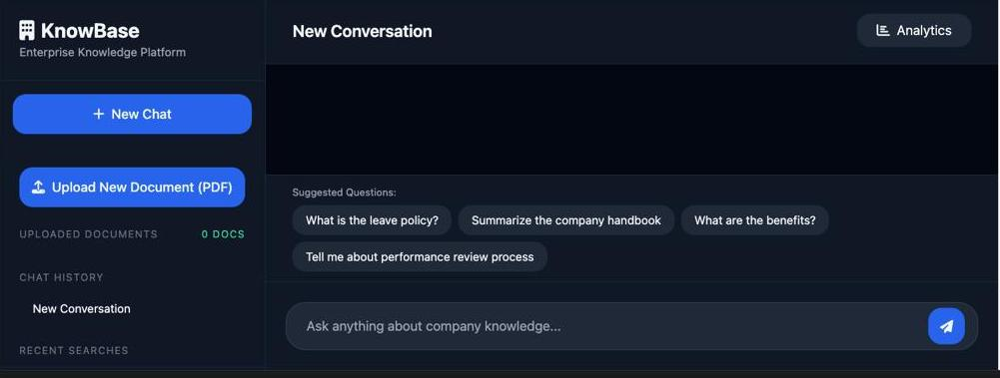

# Enterprise-Knowledge_Assistant

# KnowBase - Enterprise Knowledge Assistant

A powerful **RAG-based internal knowledge base** that allows employees to chat with company documents using hybrid search and Groq LLM.


<!-- Replace above with actual image URL after uploading screenshot to GitHub or Imgur -->



---

## ✨ Features

- **PDF Upload & Processing** with automatic chunking
- **Hybrid Search** (Vector + BM25)
- **AI Chat** powered by Groq (Llama-3.3-70B) with source citations
- **JWT Authentication** with role-based access
- **Uploaded Documents Management** (View + Delete)
- **Multiple Chat History**
- **Smart Query Suggestions**
- **Analytics Dashboard**

---

### 📸 Screenshot


_Modern dark UI with sidebar navigation, document management, and chat interface_

---

## 🛠 Tech Stack

- **Backend**: FastAPI, ChromaDB, Rank-BM25, Groq
- **Frontend**: HTML + Tailwind CSS + Vanilla JS
- **Embeddings**: `all-MiniLM-L6-v2`

---

## 🚀 Quick Start

### Prerequisites

- Python 3.10+
- Groq API Key

### Installation

1. Clone the repo:

```bash
git clone <your-repo-url>
cd Enterprise-Knowledge_Assistant

Setup environment:

Bashpython -m venv venv
source venv/bin/activate    # On Windows: venv\Scripts\activate
pip install -r requirements.txt

Create .env file:

envGROQ_API_KEY=gsk_xxxxxxxxxxxxxxxx

Run Backend:

Bashcd src
python main.py

Open frontend/index.html with Live Server (VS Code recommended).


🔑 Default Credentials

hr@company.com / hr123
finance@company.com / finance123
admin@company.com / admin123


📁 Project Structure
text├── src/
│   ├── main.py
│   └── rag.py
├── frontend/
│   ├── index.html
│   └── script.js
├── uploaded_docs/
├── chroma_db/
└── README.md

🎯 Key Features

Hybrid semantic + keyword search
Document upload with real-time processing
Chat history and multiple conversations
Source citations in every response
Clean, professional enterprise UI
```
